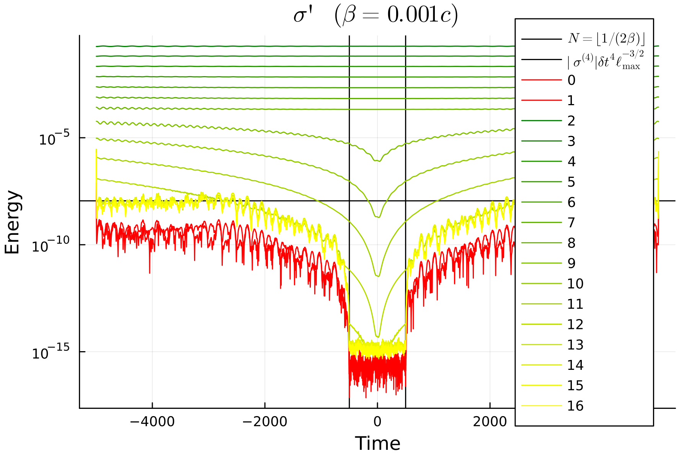

# Splines

Given tabulated gravitational-wave data sampled at discrete retarded
times, BMS transformations (other than simple time shifts or
rotations) involve changing time slices, thus requiring interpolation
to evaluate the waveform in a given direction at the appropriate time.
But if the interpolation is not globally smooth, the resulting
function on the sphere will have a *spatial* discontinuity at some
finite order of tangential derivative, which in turn causes the SWSH
expansion to converge only algebraically, with a persistent power-law
floor in the truncation error as ``ℓ_\text{max}' → ∞``.  Here, we
quantify this effect for B-spline interpolation, which is commonly
used in numerical-relativity waveforms.

A B-spline of order ``n`` (polynomial degree ``n-1``, so the familiar
cubic spline is order 4) achieves ``C^{n-2}`` continuity *at* knots,
and ``C^∞`` continuity *between* knots, with interpolation error
bounded by ``O(Mₙ (δt)^n)`` where ``Mₙ = \max|H⁽ⁿ⁾|`` is the largest
magnitude of the ``n``-th derivative of the function being
interpolated [Schumaker_2007, Unser_1993](@cite).

Within any single spline interval all sky directions ``n̂`` require
rest-frame times from that same cubic (or degree-``(n{-}1)``)
polynomial, so the function ``f(n̂) = H_\text{spline}\left(t'
K^{-1}(n̂)\right)`` on the sphere is a polynomial composed with the
smooth Doppler factor ``K^{-1}(n̂)``, hence analytic, and its SWSH
expansion converges exponentially.  Once different sky directions
require times from different spline intervals, however, the angular
function acquires a ``C^{n-2}`` kink — a jump in the ``(n-1)``-th
tangential derivative — along the level-set curve ``{t' K^{-1}(n̂) =
t_k}`` on ``S²``.  For a boost of speed ``β`` this transition first
occurs when ``2β|t'| > δt``, i.e., after only ``N_\text{good} ≈ ⌊
1/(2β) ⌋`` time steps from the retarded-time origin.  An additional
supertranslation of peak-to-peak amplitude ``Δα`` reduces this to
``N_\text{good} ≈ \max(0, ⌊ (1 - Δα/δt)/(2β) ⌋)``.

It's worth pausing for a moment to remark on this unusual relation:
for a simple boost, the *number of time steps away from ``t=0``* that
can be accurately represented is determined by the boost.  This is a
discrete number being given by a continuous parameter, and is
independent of the coarseness of the time sampling.  The really
remarkable thing is how precisely this relation is borne out in
practice, with a discontinuous jump in the error at the predicted time
step, regardless of the characteristics of the system being
transformed.  This number is further reduced by any supertranslation,
in a way that *does* depend on the time sampling.

The spectral consequences of the kink are quantified by
[Livermore_2012](@citet): a function on ``S²`` with an algebraic
singularity of order ``p`` along a smooth curve has energy spectrum
``E(ℓ) ∼ ℓ⁻⁽ᵖ⁺¹⁾``, where energy is defined as the sum of the squares
of the SWSH coefficients at each ``ℓ``:
```math
E(ℓ) = \sum_{m=-ℓ}^ℓ |f_{ℓm}|^2.
```
For an order-``n`` B-spline the singularity order is ``p = n-1``,
giving
```math
E(ℓ) ∼ ℓ^{-n},
\qquad ϵ_\text{trunc} ∼ Mₙ(δ t)^n ⋅ (ℓ_\text{max}')^{-(n-1)/2}.
```
For cubic splines (``n = 4``) this yields ``E(ℓ) ∼ ℓ^{-4}`` and
``ϵ_\text{trunc} ∼ M₄ (δt)^4 (ℓ_\text{max}')^{-3/2}``, a persistent
power-law floor analogous to the Gibbs phenomenon
[GottliebShu_2026](@cite).  Using higher-order splines lowers the
floor as ``Mₙ(δt)^n`` and steepens the power law, but convergence
requires ``ω_\text{max}\,δ t < 1`` (all frequencies sampled above
Nyquist), and for numerical-relativity waveforms the effective upper
frequency is close to Nyquist, limiting practical improvement.

It is possible to test exponential convergence by using a globally
smooth interpolant, such as a Chebyshev expansion, which is not
piecewise-defined and thus has no knots.  However, Chebyshev
expansions are not well suited to tabulated data because between the
data points they can have large and unphysical oscillations.  The
constructed functions are better thought of as *representative* of
gravitational waveforms exclusively for testing purposes, rather than
representing true physics.


## Example

Here, we demonstrate these effects using a simple test waveform
boosted to ``\beta = 0.001c``.  The test waveform is given by
```math
σ_{ℓ,m} = \begin{cases}
Ω^{ℓ/3} \exp\left(-i m Ω t\right) & 2 \leq ℓ \leq 8, \\
0 & \text{otherwise},
\end{cases}
```
with ``Ω ≈ 0.025``, ``v = ∛Ω``, and sampling of ``δt ≈ 1``.  The
``Ω^{ℓ/3}`` is chosen to *very* roughly correspond to the
post-Newtonian scaling, and the phase corresponds to rigid rotation
with constant frequency ``Ω`` chosen to be below the Nyquist frequency
even up to ``ℓₘₐₓ=16``.

The "good" region is delimited with a pair of vertical bars, and the
predicted spline plateau is shown as a horizontal bar.  The plot shows
the energy spectrum of the transformed ``σ'`` components.  The modes
with ``2 ≤ ℓ ≤ 8`` are roughly constant in time and converge
exponentially with increasing ``ℓ``, as expected.  Modes with ``ℓ >
8`` converge very quickly to machine precision at ``t=0``, but
increase in both directions from there, roughly linearly with time.
Again, this is the expected analytical behavior.  The modes with ``ℓ ≳
13`` are initially below ``ℓₘₐₓ ϵ`` (where ``ϵ ≈ 10^{-16}`` is machine
precision), but beyond ``N_\text{good} = ⌊ 1/(2β) ⌋`` they immediately
jump up to the resolved ``ℓ=12`` mode, until they plateau at the
predicted level.

Note that the ``ℓ=0`` and ``1`` modes shown in red would analytically
be zero, but are retained for diagnostic purposes.  These are the
``\xi`` quantities described in [the previous page](@ref
Augmenting-to-a-square,-prefactorable-system).  The fact that they are
smaller than any other modes is a good consistency check that the
algorithm is working as expected.



One very important point is that this structure is the same regardless
of the precision of the numbers being used.  We can use [`Double64`
numbers](https://juliamath.github.io/DoubleFloats.jl/stable/), which
have ``ϵ ≈ 10^{-32}``.  We also have to extend to ``ℓₘₐₓ = 20`` to
obtain full convergence to this new ``ℓₘₐₓ ϵ``.  Nonetheless, the
"noise" plateau does not change significantly — either in the width of
the "good" region, or in the level of the plateau.  That is, the
plateau is not a numerical artifact, but a real feature whenever we
interpolate with finite smoothness.
